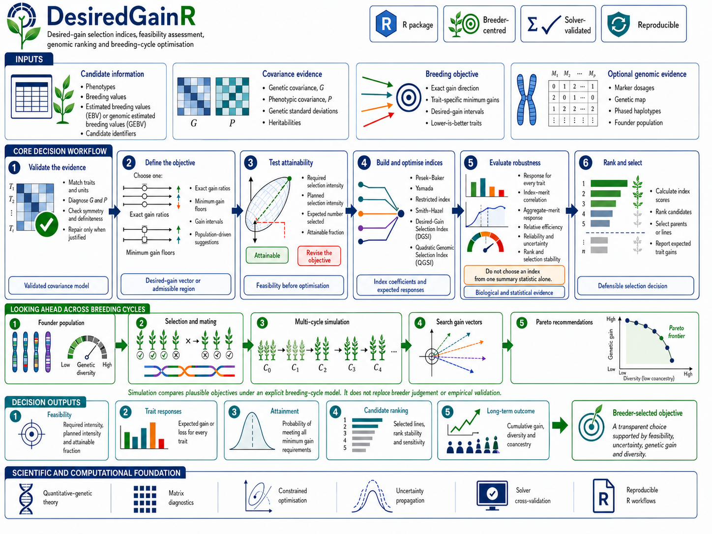

# DesiredGainR

<!-- badges: start -->

[](https://github.com/FAkohoue/DesiredGainR/actions/workflows/R-CMD-check.yaml)
[](https://github.com/FAkohoue/DesiredGainR/actions/workflows/pkgdown.yaml)
[](https://opensource.org/licenses/MIT)

<!-- badges: end -->

**Computing a selection index is arithmetic. Deciding what it should select for
is the difficult part.**

DesiredGainR is organised around the breeding objective rather than around the
index. The literature is consistent that specifying economic weights, not
computing coefficients, is what obstructs routine index use: Guimarães et al.
(2021) showed that supplying arbitrary weights eliminated the gains the same
indices delivered under sensible ones, and Covarrubias-Pazaran (2021) advises
breeders not to interpret index coefficients at all, because the desired
response is the only decision genuinely available to them.

The package provides an exact algebraic map between economic weights and
desired gains under a stated covariance model. These inputs retain different
biological meanings. Economic weights define aggregate merit. Desired gains
define a response direction. DesiredGainR also tests whether a stated objective
can be attained at the planned selection intensity. It recovers the objective
a programme has been applying implicitly. It reports how far a decision
depends on uncertain weights. The package includes the classical index
families, the iterative optimisation procedure applied to the desired-gain
index by Joukhadar et al. (2024), and the quadratic genomic selection index of
Cerón-Rojas et al. (2026). A multi-cycle simulation layer uses founders built
from the breeder's own phased marker data.

DesiredGainR begins **after** the genetic evaluation. It does not analyse field
trials, fit mixed models, or estimate breeding values, and it does not design
crossing plans. It ends with a defined objective, index coefficients and
scores, expected response, feasibility and uncertainty diagnostics. Use
[HapBlockR](https://github.com/FAkohoue/HapBlockR) for the next decision:
choosing parents, controlling relatedness through optimal contribution
selection (OCS), performing optimum cross selection and allocating matings. The
dependency is deliberately one way: HapBlockR's `build_selection_index()`
delegates DGSI and QGSI construction to DesiredGainR and then carries the merit
score into its parent- and cross-selection tools.

In DesiredGainR, `n_select` is an **analytical truncation count**. It determines
selection intensity and identifies the top-ranked set used to calculate or
compare response. It is not a recommendation that those candidates should be
the final parents, nor does it decide their contributions or pairings.

<p align="center">
  
</p>

## Why DesiredGainR is valuable

DesiredGainR turns an uncertain breeding objective into a transparent,
quantitative decision. It is especially useful when economic weights lack a
defensible basis or when the breeder can state acceptable trait-specific gains more
confidently than monetary values.

- It expresses every objective in breeder-facing desired-gain units, including
  genetic standard deviations and original trait units.
- It checks whether requested gains are mathematically feasible before a
  selection decision is made.
- It can search trait-specific intervals and suggest both a minimum-attainment
  solution and a maximum-balanced solution from the current population.
- It reports several defensible gain vectors with independently confirmed
  support, stability and uncertainty instead of presenting one opaque answer.
- It compares classical, restricted, general, iteratively optimised
  desired-gain and quadratic genomic fits against one declared objective.
- It combines exact one-cycle quantitative-genetic mathematics, independently
  validated optimisation, genomic prediction, multi-environment testing and
  multi-cycle simulation.

The package's evidence portfolio includes a complete public-function test
registry, family-level behavioural tests, independent Clarabel and OSQP solver
comparisons, analytical and Monte Carlo theory checks, and six real
breeding-programme validations. In the CIMMYT maize rapid-cycle
programme, DesiredGainR's validation suite reproduced the published yield-gain
trajectory, recovered a strong raw genomic-prediction signal, verified all
1,000 training-family phenotype-to-genotype links, and tested desired-gain
directions in environments excluded from fitting.

DesiredGainR is therefore intended for rigorous, auditable breeding decision
support. Its probabilities describe support under the fitted genetic model and
declared breeding scenario; the package presents those assumptions alongside
the recommendation so the breeder can judge and defend the decision.

---

## Installation

DesiredGainR requires R 4.1.0 or later.

```r
install.packages("remotes")
remotes::install_github("FAkohoue/DesiredGainR",
  build_vignettes = TRUE,
  dependencies = TRUE
)
```

Set `build_vignettes = FALSE` to skip building the vignettes locally; they
remain available on the package website.

The multi-cycle simulation layer additionally requires **AlphaSimR**, which is
not installed automatically:

```r
install.packages("AlphaSimR")
```

---

## Documentation

Full documentation is at
**<https://FAkohoue.github.io/DesiredGainR/>**.

| Vignette | Covers |
|---|---|
| [Introduction](https://FAkohoue.github.io/DesiredGainR/articles/DesiredGainR-introduction.html) | Orientation, input formats, definitions, conventions |
| [Full pipeline](https://FAkohoue.github.io/DesiredGainR/articles/DesiredGainR-pipeline.html) | Sixteen-stage walkthrough assuming no prior knowledge |
| [Complete workflow](https://FAkohoue.github.io/DesiredGainR/articles/DesiredGainR-workflow.html) | The same path condensed, with cross-references |
| [Defining a breeding objective](https://FAkohoue.github.io/DesiredGainR/articles/DesiredGainR-objective.html) | How to state, test and defend an objective |
| [Defining desired gains and intervals](https://FAkohoue.github.io/DesiredGainR/articles/DesiredGainR-desired-gain-intervals.html) | Trait-specific minima, interval elicitation and population-driven suggestions when one exact vector is not defensible |
| [Obtaining G and P](https://FAkohoue.github.io/DesiredGainR/articles/DesiredGainR-covariance.html) | Covariance estimands, import, working alternatives, diagnostics and reporting |
| [Multiple-trait selection](https://FAkohoue.github.io/DesiredGainR/articles/DesiredGainR-index-families.html) | Definitions, method choice, implementation, fair comparison and decision criteria |
| [Using predictions and prediction errors](https://FAkohoue.github.io/DesiredGainR/articles/DesiredGainR-information.html) | Distinct information and objective traits, GEBV uncertainty, Cunningham efficiency and Satoh restricted responses |
| [Iterative optimisation of the desired-gain index](https://FAkohoue.github.io/DesiredGainR/articles/DesiredGainR-dgsi.html) | What iteration changes, target units, transmitted response and optimisation stability |
| [Quadratic genomic selection](https://FAkohoue.github.io/DesiredGainR/articles/DesiredGainR-qgsi.html) | Complete QGSI demonstration, weight interpretation, contributions and linear comparison |
| [Multi-cycle simulation](https://FAkohoue.github.io/DesiredGainR/articles/DesiredGainR-simulation.html) | Comparing objectives over several breeding cycles |
| [Published-result reproduction](https://FAkohoue.github.io/DesiredGainR/articles/DesiredGainR-reproduction.html) | Independent checks against published selection-index results |
| [Empirical validation](https://FAkohoue.github.io/DesiredGainR/articles/DesiredGainR-empirical-validation.html) | Six real-programme validations of cycle gain, genomic signal, index transport and multi-environment recommendation behaviour |
| [Working with other breeding software](https://FAkohoue.github.io/DesiredGainR/articles/DesiredGainR-interoperation.html) | Safe hand-offs from genetic evaluation through selection to downstream mating tools |

The [function reference](https://FAkohoue.github.io/DesiredGainR/reference/)
documents every exported function. `open_desiredgain_guide()` opens a
plain-language Breeder's Guide for readers who approve a selection decision
without running R.

---

## Community

| Document | Purpose |
|---|---|
| [Support](SUPPORT.md) | Where to ask, and what to record first |
| [Contributing](CONTRIBUTING.md) | How to report a bug or propose a change |
| [Code of conduct](CODE_OF_CONDUCT.md) | Expected behaviour, including scientific conduct |
| [Security](SECURITY.md) | Private disclosure, including defects that return wrong numbers |
| [Citation](CITATION.cff) | Machine-readable citation metadata |

Report reproducible bugs through the
[issue tracker](https://github.com/FAkohoue/DesiredGainR/issues). Do not place
confidential germplasm or phenotype records in public issues.

---

## Citation

```r
citation("DesiredGainR")
```

Machine-readable metadata are in [CITATION.cff](CITATION.cff). A digital object
identifier has not yet been assigned; do not cite a provisional one.

Cite the method as well as the software when a specific index is used. The
relevant primary references are listed below.

---

## References

- Cerón-Rojas JJ, Montesinos-López OA, Montesinos-López A, et al. (2026).
  Nonlinear genomic selection index accelerates multi-trait crop improvement.
  *Nature Communications* **17**:1991.
  <https://doi.org/10.1038/s41467-026-69890-3>
- Covarrubias-Pazaran G (2021). *Practical implementation of selection
  indices.* CGIAR Excellence in Breeding.
- Gaynor RC, Gorjanc G, Hickey JM (2021). AlphaSimR: an R package for breeding
  program simulations. *G3 Genes|Genomes|Genetics* **11**:jkaa017.
  <https://doi.org/10.1093/g3journal/jkaa017>
- Guimarães PHR, Melo PGS, Cordeiro ACC, Torga PP, Rangel PHN, de Castro AP
  (2021). Index selection can improve the selection efficiency in a rice
  recurrent selection population. *Euphytica* **217**:95.
  <https://doi.org/10.1007/s10681-021-02819-7>
- Joukhadar R, Li Y, Thistlethwaite R, Forrest KL, Tibbits JF, Trethowan R,
  Hayden MJ (2024). Optimising desired gain indices to maximise selection
  response. *Frontiers in Plant Science* **15**:1337388.
  <https://doi.org/10.3389/fpls.2024.1337388>
- Pesek J, Baker RJ (1969). Desired improvement in relation to selection
  indices. *Canadian Journal of Plant Science* **49**:803-804.
  <https://doi.org/10.4141/cjps69-137>
- Rahimi M, Debnath S (2023). Estimating optimum and base selection indices in
  plant and animal breeding programs by development new and simple SAS and R
  codes. *Scientific Reports* **13**:18977.
  <https://doi.org/10.1038/s41598-023-46368-6>
- Smith HF (1936). A discriminant function for plant selection. *Annals of
  Eugenics* **7**:240-250.
- Yamada Y, Yokouchi K, Nishida A (1975). Selection index when genetic gains of
  individual traits are of primary concern. *Japanese Journal of Genetics*
  **50**:33-41. <https://doi.org/10.1266/jjg.50.33>

---

## Licence

MIT © Félicien Akohoue
